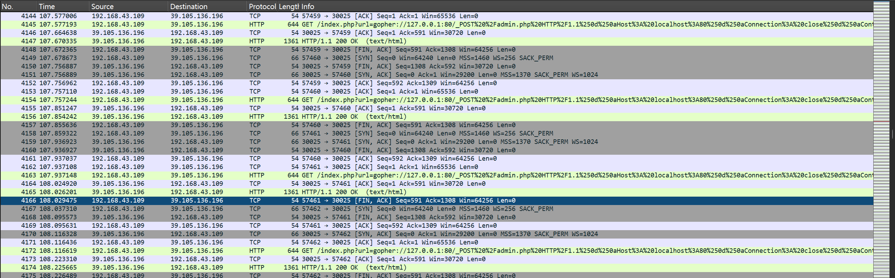

CTF · MISCELLANEOUS

# misc?

---
layout: default
class: content-page intro-page
---

01 · INTRO

# Misc是什么？有什么特点？

Miscellaneous

  

    
Misc，也就是<strong>安全杂项</strong>

    
在 CTF 中，不能归类到其他方向的题目，都属于 Misc 的范畴

  

  

    
<b>01</b>内容种类多，范围广

    
<b>02</b>对前置基础要求较低，学习曲线平缓

    
<b>03</b>知识点有趣（吗

  

接下来，让我们一起走进 Misc 的世界 →

---
layout: default
class: content-page topics-page
---

02 · OVERVIEW

# Misc 包含什么？

  
<b>01</b>编码

  
<b>02</b>隐写

  
<b>03</b>压缩包

  
<b>04</b>OSINT

  
<b>05</b>流量 / 内存 / 磁盘取证

  
<b>06</b>应急响应

  
<b>07</b>区块链

  
<b>08</b>AI安全

  
<b>more</b>....

---
layout: default
class: content-page encoding-page
---

03 · ENCODE & DECODE

# 编码

encode&decode

  

    
编码把原始信息转换为另一种形式，经常用于数据的<strong>传输和储存</strong>

    
在 Misc 中，我们会遇到不同形式的编码

  

  

    
从最简单的 ASCII、base64 到神秘的文字、看似杂乱无章的字符，都可能是一种编码

    
识别<i>→</i>搜索<i>→</i>解码

  

我们就要在已有知识的基础上，在网上搜索相关信息来解出编码中的信息

<!-- 比如计算机的底层使用2进制编码，而网页的数据传输通常使用base64编码 -->

---
layout: default
class: content-page steganography-page
---

04 · STEGANOGRAPHY

# 隐写

Steganography

  

    
隐写是一种将<strong>秘密信息</strong>隐藏在其他载体中的技术

    
这个载体可以是图片，视频，甚至是一段普通的文本

    
计算机中的文件以二进制形式存储，因此信息可以通过不同方式隐藏在文件数据之中。

  

  

    
常见隐写载体包括

    
图片隐写音频隐写视频隐写文档隐写

  

隐写包含的内容很多，且层出不穷，要结合题目持续学习和实践

---
layout: image-right
image: '/powchanosint1.jpg'
class: osint-page

---

05 · OPEN SOURCE INTELLIGENCE

# OSINT

Open source intelligence

OSINT也是 Misc 的一部分。

它通过公开可获得的信息进行搜集、关联和分析

简单来说，网络上所说的“开盒”就是从开源信息中找到人的信息和地理位置

一些看似普通的公开信息也可能暴露位置、身份或其他隐私线索

---
layout: default
class: content-page archive-page
---

06 · ARCHIVE

# 压缩包

形形色色的压缩包

  

    
Misc 题目中也常见各种<strong>加密的压缩包</strong>

    
有些密码藏在旁边的隐写中，有些密码甚至根本无法恢复

  

  

    
<b>01</b>密码爆破

    
<b>02</b>修复伪加密

    
<b>03</b>明文攻击

  

最基础：<strong>直接尝试恢复</strong>密码更高级：理解压缩包的<strong>结构和工作原理</strong>

---
layout: default
class: content-page forensics-page
---

07 · FORENSICS

# 流量分析（取证）

forensics

  
取证是从数据中恢复，寻找并分析有价值的信息，最常见的是流量取证

  
流量一般就是网络/USB流量，设备和网络活动传输的一个个数据包汇集起来就变成了一组流量

  
流量分析，就是对这些数据包进行查看和分析，从中寻找通信内容与相关线索

  
<i></i><i></i><i></i>pcap 流量包

  

---
layout: end
class: end-page
---

END OF PRESENTATION

# THANKS FOR WATCHING

## 谢谢观看

主讲人：taem

